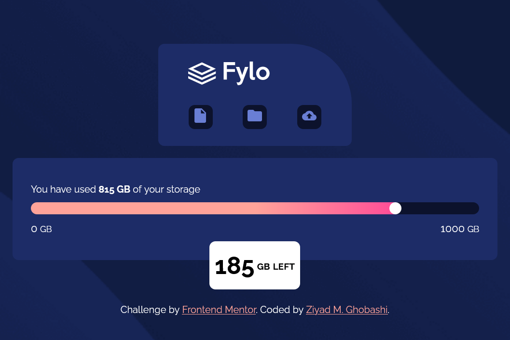
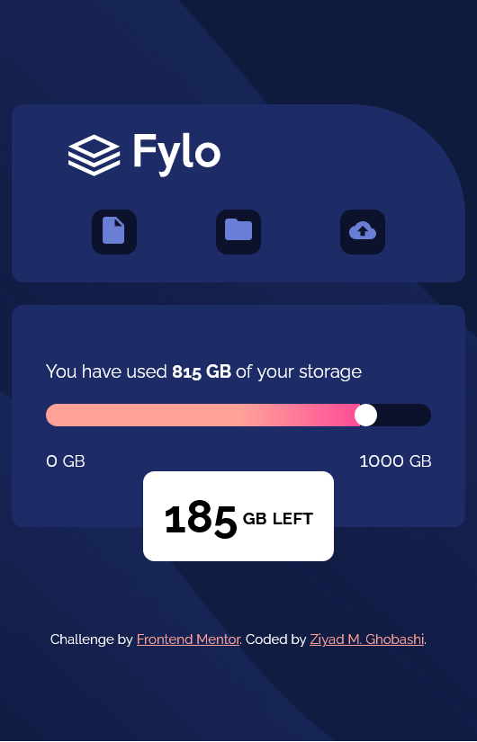

# Frontend Mentor - Fylo data storage component solution

This is a solution to the [Fylo data storage component challenge on Frontend Mentor](https://www.frontendmentor.io/challenges/fylo-data-storage-component-1dZPRbV5n).

## Table of contents

- [Overview](#overview)
  - [The challenge](#the-challenge)
  - [Screenshot](#screenshot)
  - [Links](#links)
- [My process](#my-process)
  - [Built with](#built-with)
  - [What I learned](#what-i-learned)
  - [Useful resources](#useful-resources)
- [Author](#author)
- [Acknowledgments](#acknowledgments)

## Overview

### The challenge

Users should be able to:

- View the optimal layout for the site depending on their device's screen size

### Screenshot





### Links

- Solution URL: [Solution Folder]()
- Live Site URL: [Live Site]()

## My process

### Built with

- HTML5.
- CSS.
- Flexbox.(to center the page elements)
- VS Code. (Editor)

### What I learned

It was easier to draw the slider using CSS instead of using range slider input.
```html
<div class="slider">
  <div class="circle"></div>
</div>
```
```css
.slider {
    width: 100%;
    height: 20px;
    background-image: linear-gradient(90deg, var(--light-red) 50%, var(--mid-red) 81.5%, var(--darker-blue) 81.5%);
    border-radius: 20px;
}

.circle {
    width:20px;
    height: 20px;
    border-radius: 20px;
    background-color: white;
    margin-left: 80%;
}
```

### Useful resources

- [FreeCodeCamp](https://www.freecodecamp.org/learn) - This helped me my certificate. I really liked it.

## Author

- Frontend Mentor - [@ziy-eg](https://www.frontendmentor.io/profile/ziy-eg)
- GitHub - [@ziy-eg](https://github.com/ziy-eg)
- FreeCodeCamp - [@ziy-ghobashi](https://www.freecodecamp.org/ziy_ghobashi)
